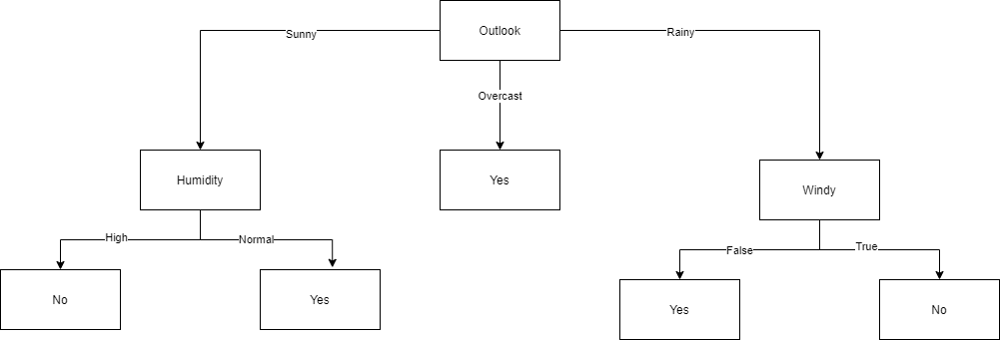

# Resultados del árbol de decision

## Árbol resultado del dataset tenis.csv

# Funcionamiento de árboles de decision con valores reales
Si este tipo de datos no es tratado durante la selección de atributos, se podrían generar infinitas ramas en el árbol. 
Es por eso, que a la hora de utilizar este atributo, se buscan los denominados "puntos de corte", los cuales se encuentran
midiendo la ganancia de la información que se obtiene al realizarlos. Para llevar a cabo este proceso, se comienza ordenando
los valores de un atributo específico, y luego, se consideran puntos que se encuentren entre dos clasificaciones distintas
del atributo objetivo, es decir, en el caso del dataset de tenis, se buscarían puntos de corte entre los valores de un atributo
que tengan una clasificación de "si" y "no" respectivamente.
